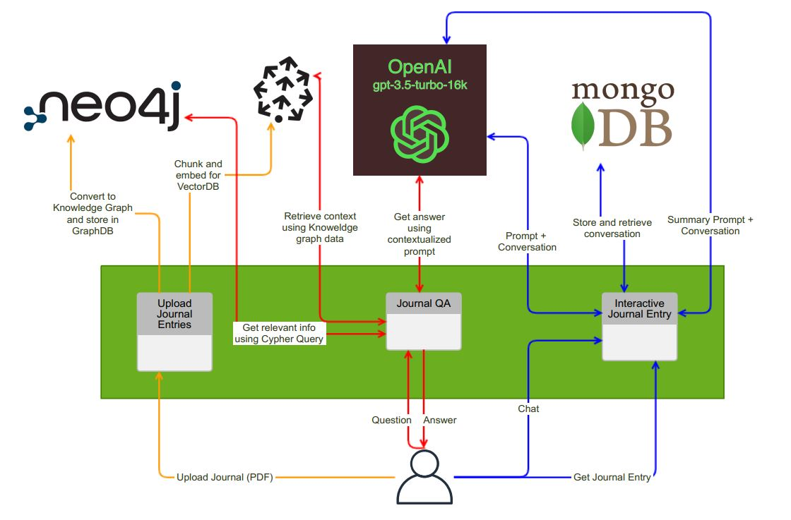

# JournalGPT


Welcome to the JournalGPT, a powerful, multi-page Streamlit application that harnesses the capabilities of several cutting-edge technologies to revolutionize the way users write journal entries, ask questions about their journals, and interactively create journal entries.

The ultimate goal of this application is to serve as a self-improvement journal that can assist users in detecting debilitating thought patterns, weaknesses, procrastination patterns etc and provide necessary resources for improving overall well-being.




## Overview

The Journal Entry Assistant consists of three distinct pages, each offering unique functionalities:

### Page 1: Journal Upload and Processing

The first page allows users to upload their journal in PDF format. Upon upload, the application performs the following tasks:

- **Knowledge Graph Creation**: The uploaded document is processed and transformed into a structured knowledge graph. This graph is then stored in a Neo4J database for efficient retrieval and analysis.

- **Text Chunking and Embeddings**: The document is chunked and converted into embeddings. These embeddings are stored in a vector database, specifically Pinecone. This enables powerful search and retrieval of relevant information.

### Page 2: Journal QA and Contextual Search

In the second page, users can ask questions related to the contents of their uploaded journal. The application provides the following features:

- **Context Extraction**: The system identifies the relevant context words within the Neo4J knowledge graph to better understand the user's query.

- **Vector Database Query**: The identified context words are sent to Pinecone for an efficient vector search. This step retrieves the necessary context for answering the user's question.

- **LLM-Powered Answering**: The retrieved context is provided to an Large Language Model (in this case, OpenAI GPT-3.5) along with a suitable prompt. This ensures that the application delivers accurate and meaningful responses to the user's questions.

### Page 3: Interactive Journal Entry Creation

On the third page, users can interactively create journal entries with the assistance of an AI language model. The process is as follows:

- **Interactive Journaling**: Users start typing their journal entries, and the AI language model engages in a conversation, asking thoughtful questions about their day. This helps users gather their thoughts and generate a more comprehensive journal.

- **MongoDB Storage**: All interactions between the user and the AI model are stored in a MongoDB Atlas NoSQL database, creating a record of the conversation.

- **Journal Entry Generation**: Once the user finishes their entry, they can click "Generate journal entry." The AI model is prompted with relevant information and a suitable title, and it returns a fully formed journal entry to the user. Optionally, users can download it in DOCX format.

### Getting Started

1. **OpenAI API Key**: You will need an OpenAI API Key to use the GPT models. Add the key to `.env.example` file.
2. **MongoDB URI**: This application currently supports a MongoDB Database for backend storage. Add the URI to `.env.example` file.
3. **Pinecone API Key**: Add the Pinecone API key to `.env.example` file.
4. **Neo4J Aura DB URI**: Create a free Neo4J Aura account and add the required details to `.env.example` file.
5. Execute the following code to get started.
```shell
cp .env.example .env
docker build -t journal-gpt .
docker run -d --env-file .env -p 8501:8501 journal-gpt
```

## Future Plans

- A new page that will allow users to store and review their journal entries and chat history.
- Experiment further with the Knowledge graph creation process to discover personality traits about the journal author.
  
---
